# 01 — UI AUDIT (Reverse-Engineered from the Existing Frontend)

**Product:** InventoryAI — AI-assisted Inventory & Procurement SaaS for Indian wholesalers/distributors
**Codebase audited:** `frontend/` — Next.js 16 (App Router) · React 19 · TypeScript · Tailwind v4 · shadcn-style components · Recharts
**Audit date:** 14 Sep 2026
**Method:** Every route, component, form, dialog, TypeScript interface, mock data file and mock service was read. Nothing in this document is assumed from the product brief — every field, status and action below exists in the code today. Divergences between the brief and the code are recorded in `09_GAPS_AND_RECOMMENDATIONS.md`.

---

## 1. Architectural facts about the current frontend

| Fact | Detail | Consequence for backend |
|---|---|---|
| No network layer exists | `src/services/http.ts` → `mockRequest(path, resolver, latencyMs)` is a `setTimeout` + static array. `API_BASE = process.env.NEXT_PUBLIC_API_BASE_URL ?? "/api"` is declared but **never used**. | Swapping in FastAPI is a single-file change if endpoint paths match the ones already embedded (§10). |
| Two persistence illusions | (a) `localStorage` record stores (`src/lib/record-store.ts`) for products, suppliers, POs, RFQs, GRNs, quotations, transactions, team, audit log. (b) `sessionStorage` for session user + one-shot screen-to-screen handoffs. | All of these become real tables. The handoff pattern (§9) becomes either request payloads or persisted draft records. |
| All filtering/search/sort is client-side | `src/lib/use-table-filter.ts` substring-matches over the **entire in-memory dataset**. | Every list endpoint needs server-side `search`, filters, sort, and real pagination. |
| Pagination is cosmetic | `TablePagination` is called with `page={1} pageSize={filtered.length}`; buttons are inert. | Cursor/offset pagination must be designed into every list API. |
| KPI numbers are hardcoded | `KPIS.totalSkus = 1248` vs 12 seeded products. | KPIs are independent aggregate endpoints, not derivable from list payloads. |
| Money maths is real | `src/lib/tax.ts` genuinely computes net/tax/total/round-off. | Backend must own this computation; frontend must stop being the source of truth (two divergent formulas exist today — see `09`). |
| Audit trail already exists client-side | `src/lib/audit-log.ts` with `entityType/entityId/entityLabel/action/actor/actorRole/timestamp/details`. | Maps 1:1 onto an `audit_logs` table — the frontend has already defined the contract. |

---

## 2. Route map (34 routes)

| # | Route | Type | Rendering |
|---|---|---|---|
| 1 | `/` | redirect → `/dashboard` | static |
| 2 | `/login` | auth | static |
| 3 | `/accept-invite/[id]` | auth | dynamic |
| 4 | `/dashboard` | app | static (server) |
| 5 | `/products` | app | static → client screen |
| 6 | `/products/[sku]` | app | dynamic (client) |
| 7 | `/suppliers` | app | static → client screen |
| 8 | `/suppliers/[id]` | app | dynamic (server) |
| 9 | `/inventory/current-stock` | app | static (server) → client screen |
| 10 | `/inventory/by-godown` | app | static (server) |
| 11 | `/inventory/low-stock` | app | static (server) → client screen |
| 12 | `/inventory/transactions` | app | static → client screen |
| 13 | `/godowns` | app | static (server) |
| 14 | `/procurement/rfq` | app | static → client screen |
| 15 | `/procurement/rfq/new` | app | static |
| 16 | `/procurement/rfq/[id]` | app | dynamic (client) — `id` = RFQ **number** |
| 17 | `/procurement/quotations` | app | static → client screen |
| 18 | `/procurement/comparison` | app | static (server) → client screen |
| 19 | `/procurement/purchase-orders` | app | static → client screen |
| 20 | `/procurement/purchase-orders/new` | app | static |
| 21 | `/procurement/purchase-orders/[id]` | app | dynamic (client) — `id` = PO **number** |
| 22 | `/procurement/proforma` | app | static → client screen |
| 23 | `/procurement/proforma/[id]` | app | dynamic (server) — `id` = `pi1..pi3` |
| 24 | `/goods-receipt` | app | static → client screen |
| 25 | `/goods-receipt/new` | app | static |
| 26 | `/goods-receipt/[id]` | app | dynamic (client) — `id` = GRN **number** |
| 27 | `/ai-documents` | app | static (server) |
| 28 | `/ai-documents/review` | app | static (server) — **no document id in the URL** |
| 29 | `/assistant` | app | static |
| 30 | `/alerts` | app | static (server) → client screen |
| 31 | `/reports` | app | static |
| 32 | `/settings` | app | static |
| 33 | `/users` | app | static → client screen |
| 34 | `/system-admin` | app | static (client, role-gated) |
| — | `/[...slug]` | catch-all | "Coming soon" placeholder for unbuilt nav targets |

> **Identifier smell:** detail routes key off human-readable **numbers** (`PO-2026-00123`) rather than ids, except Proforma (`pi1`) and Supplier (`sup_x`). The backend must expose both (`id` UUID as canonical, `number` as a unique business key) — see `09`.

---

## 3. Screen inventory

Legend: ✓ = implemented and wired · ◐ = present in UI but not functional · – = not present

| Screen | Route | Purpose | Main entities | C | R | U | D | Special actions |
|---|---|---|---|---|---|---|---|---|
| Login | `/login` | Authenticate; route by role | User | – | – | – | – | Username **or** email sign-in; demo-account quick-fill; "Keep me signed in"; show/hide password; Super Admin → `/system-admin`, else `/dashboard`; "Forgot password?" ◐ |
| Accept Invitation | `/accept-invite/[id]` | Invitee sets password, becomes member | Invitation → Member | – | ✓ | ✓ | – | Password + confirm (min 6); invalid-invite state; redirect to login |
| Dashboard | `/dashboard` | Owner's daily overview | KPIs, StockStatus, LowStockRow, ActivityItem, ProcurementStat | – | ✓ | – | – | 8 KPI cards; donut chart; low-stock table; recent-activity feed; 4 procurement stat tiles with deep links |
| Products | `/products` | SKU catalogue | Product | ✓ | ✓ | ✓ | ✓ | Add/Edit via `ProductFormDialog`; row menu View/Edit/Create RFQ/Delete; filters category/brand/stock-status/godown; "Import Excel" ◐ |
| Product Detail | `/products/[sku]` | Full SKU view | Product, Transaction | – | ✓ | ✓ | ✓ | Identification block; attributes block (hidden when empty); per-godown stock split; transaction history filtered by SKU; Audit Trail; Create RFQ link; Images & Documents ◐ |
| Suppliers | `/suppliers` | Supplier directory | Supplier | ✓ | ✓ | ✓ | ✓ | Add/Edit via `SupplierFormDialog`; delete confirm; filters type/city/status |
| Supplier Detail | `/suppliers/[id]` | Supplier 360 | Supplier, PurchaseOrder | – | ✓ | ✓ | ✓ | Performance bars (on-time %, quality); contacts list; PO history table; Send RFQ link; Audit Trail; Documents ◐ |
| Current Stock | `/inventory/current-stock` | Product × godown grid | StockRow, Godown | – | ✓ | – | – | 4 KPI cards; filters godown/category/brand/status; Export ◐; explicit banner "stock is the sum of every transaction" |
| Stock by Godown | `/inventory/by-godown` | Stock grouped per godown | Godown, StockRow | – | ✓ | – | – | "Transfer Stock" ◐ |
| Low Stock | `/inventory/low-stock` | Reorder worklist | LowStockItem | – | ✓ | – | – | Multi-select rows → **Create RFQ** (hands off items + suppliers); "Create RFQ for All"; est. reorder value footer |
| Transactions | `/inventory/transactions` | Stock ledger | Transaction | ✓ | ✓ | – | – | `NewTransactionDialog` (Transfer/Damage/Sales Issue/Correction); Export ◐ |
| Godowns | `/godowns` | Warehouse cards | Godown | ◐ | ✓ | – | – | Capacity bar; "Add Godown" ◐; "View stock" link |
| RFQ List | `/procurement/rfq` | All RFQs | Rfq | – | ✓ | – | – | Filters status/supplier; quote-count link → quotations |
| RFQ Create | `/procurement/rfq/new` | Raise an RFQ | Rfq, RfqItem | ✓ | – | – | – | Supplier multi-select chips; AI product-match suggestion per line (Accept/Keep mine); Save Draft; **Send RFQ** (confirm); reads low-stock handoff |
| RFQ Detail | `/procurement/rfq/[id]` | View / edit draft | Rfq | – | ✓ | ✓ | ✓ | Draft → inline edit form; non-draft → read-only + Print + Delete; Audit Trail |
| Quotations | `/procurement/quotations` | Received quotations | Quotation | – | ✓ | – | ✓ | Row select → **Compare Selected** (≥2, dedupes suppliers); **Compare All**; Upload Quotation → `/ai-documents`; AI-confidence meter on AI-extracted rows |
| Comparison | `/procurement/comparison` | Side-by-side supplier compare | ComparisonRow/Cell, CommercialTerm | – | ✓ | – | – | Per-line supplier selection; "Reset to recommended"; savings vs cheapest single supplier; >5% price-gap warning; **Create PO(s)** → split by supplier |
| PO List | `/procurement/purchase-orders` | All POs | PurchaseOrder | – | ✓ | – | – | Filters; received-% progress; pipeline value header |
| PO Create | `/procurement/purchase-orders/new` | Raise PO(s) | PurchaseOrder, PoLine | ✓ | – | – | – | Multi-supplier tabs (from comparison handoff); Link RFQ (auto-pull items when empty); Add Item; tax summary; Save Draft; **Approve** (confirm); **Send to Supplier** (confirm); What's-Next panel |
| PO Detail | `/procurement/purchase-orders/[id]` | View / edit draft | PurchaseOrder | – | ✓ | ✓ | ✓ | Draft → inline edit; non-draft → read-only + Print (branded letterhead) + Delete; Audit Trail |
| Proforma List | `/procurement/proforma` | Supplier advance bills | ProformaListItem | – | ✓ | – | – | Filters status/supplier; Upload Proforma → `/ai-documents` |
| Proforma Detail | `/procurement/proforma/[id]` | Check proforma vs PO | Proforma, ProformaLine | – | ✓ | – | – | PO vs Proforma vs Difference cards; per-line rate-change badges; GST summary; source-document card (AI, 94%); Print; "Proceed to Goods Receipt"; "Raise query" ◐ |
| GRN List | `/goods-receipt` | All receipts | GRN | – | ✓ | – | – | Filters status/godown |
| GRN Create | `/goods-receipt/new` | Receive goods | GRN, GrnLine | ✓ | – | – | – | **Import from PO**; per-line received/accepted/rejected + issue + remarks; live short/excess detection; Mismatches Detected panel; attach documents ◐; Save Draft; **Confirm Receipt** (confirm) |
| GRN Detail | `/goods-receipt/[id]` | View receipt | GRN | – | ✓ | – | ✓ | Read-only; Print (internal-document header); Delete (warns inventory is **not** reversed) |
| AI Documents | `/ai-documents` | Upload & watch processing | AiDocument | ◐ | ✓ | – | – | Drag-drop dropzone (`.xlsx,.xls,.csv,.pdf,.docx,.jpg,.jpeg,.png`, ≤20 MB) ◐ **not wired**; per-row state badge + progress + stage + confidence; Review / View / Re-upload ◐ |
| Extraction Review | `/ai-documents/review` | Human-approve AI extraction | Extraction, ExtractedField, ExtractedLine | – | ✓ | ✓ | ✓ | Side-by-side original vs extracted; edit any field (→ `user_approved`); match unmatched lines to SKU; per-field & per-line confidence; "How AI reached this result" pipeline; **Approve** (blocked while unresolved) / **Reject** / Delete; Print |
| AI Assistant | `/assistant` | Natural-language inventory Q&A | — | – | ✓ | – | – | Suggested questions; answer + breakdown + table + deep link; read-only disclaimer |
| Alerts | `/alerts` | Notification centre | AlertItem | – | ✓ | ◐ | – | Severity counters; filters severity/category; Mark all as read; Open (marks read) — **state only, lost on reload** |
| Reports | `/reports` | Report launcher | — | – | ◐ | – | – | 12 report cards in 3 groups; global date/godown/category filters ◐; Export ◐ |
| Settings | `/settings` | Tenant configuration | Company settings | – | ◐ | ◐ | – | Business details, document numbering, tax & currency, AI behaviour toggles, alert thresholds & notifications — **entirely inert** |
| Users | `/users` | Team management | Member, Invitation | ✓ | ✓ | – | ✓ | Invite User dialog; Pending Invitations panel (Invite Link / Resend / Revoke); Remove member (Owner exempt); Team Activity audit list |
| System Admin | `/system-admin` | Platform tenant admin | Company, PlatformUser | ✓ | ✓ | ✓ | – | Role-gated ("Access restricted"); KPI cards; Companies tab (Add Company, Suspend/Reactivate); All Users tab (**Impersonate**); Platform Activity tab (audit feed) |

### 3.1 Dialogs and sub-screens carrying business fields

| Dialog | Host screen | Fields captured | Notes |
|---|---|---|---|
| `ProductFormDialog` | Products, Product Detail | name, sku (locked on edit), brand, category, subcategory, unit, currentStock, reorderPoint, reorderQty, purchasePrice, salePrice, mrp, hsn, gstRate, barcode | SKU uniqueness checked client-side; status derived from stock vs reorder point |
| `SupplierFormDialog` | Suppliers, Supplier Detail | name, gstin, type, city, state, contactPerson, phone, email | Remaining `Supplier` fields defaulted silently |
| `NewTransactionDialog` | Transactions | kind, sku, qty, fromGodown/toGodown/godown, direction, reference, remarks | Transfer emits **two** rows sharing one reference; `remarks` is captured then **discarded** |
| `InviteUserDialogContent` | Users | name, email, role, godown | Duplicate email/invite check client-side |
| `AddCompanyDialog` | System Admin | name, ownerEmail, city, state | Creates a Trial tenant |
| `ConfirmDialog`/`ConfirmButton` | everywhere | — | Every state-changing action is confirmation-gated |
| `RfqLinkField` | PO form | linkedRfq | Validates against known RFQ numbers; states empty/valid/invalid |
| Dirty-navigation guard | all forms | — | "Leave without saving?" on in-app nav + `beforeunload` |

---

## 4. Entity field inventory (exact identifiers from the code)

### 4.1 Identity & tenancy
| Entity | Fields |
|---|---|
| `User` | `id, name, email, role, company, companyId?, avatarUrl?, status` |
| Mock account | `username, email, password, user` → `superadmin/superadmin`, `useradmin/useradmin` |
| `Member` (team-store) | `id, name, email, role, godown, lastActive, status` |
| `Invitation` | `id, name, email, role, godown, invitedOn, invitedBy, resendCount` |
| `Company` | `id, name, gstin, city, state, plan, status, usersCount, createdOn, ownerEmail` |
| `PlatformUser` | `id, name, email, role, companyId, companyName, status` |
| `BUYER_PROFILE` (tenant identity used on print) | `name, gstin, address, email, phone` |

### 4.2 Catalogue
| Entity | Fields |
|---|---|
| `Product` | `id, sku, name, brand, category, subcategory?, unit, currentStock, reserved, reorderPoint, reorderQty, status, purchasePrice, salePrice, mrp, hsn, gstRate, barcode?, ean?, upc?, mpn?, manufacturer?, attributes: Record<string,string>, godowns: GodownStock[], emoji` |
| `GodownStock` | `godown, qty, reserved` |
| `attributes` keys observed | `Capacity, Material, Model, Colour, "Pack Size", Type, Warranty` |
| `CATEGORIES` | Home Appliances, Large Appliances, FMCG, Grocery, Hardware, Electricals |
| `BRANDS` | Pigeon, Philips, LG, Aashirvaad, Haldiram, Crompton, Havells, Whirlpool, Prestige, Bajaj |
| Units observed | `Nos, Pack, Box, Kg, Litre, Metre, Set, Pkt, Bag` |
| `Supplier` | `id, name, gstin\|null, pan\|null, city, state, address, type, contactPerson, phone, email, status, paymentTerms, productsSupplied, totalPurchases, openOrders, onTimeDelivery, qualityScore, contacts[]` |
| `SupplierContact` | `name, designation, phone, email` |
| `Godown` | `id, name, city, incharge, skus, value, capacityUsed` |

### 4.3 Inventory
| Entity | Fields |
|---|---|
| `StockRow` (derived view) | `id, product, sku, brand, category, godown, qty, reserved, unit, status, value` — `value = qty × purchasePrice`; "Available" = `qty − reserved` computed in UI |
| `Transaction` | `id, date, product, sku, godown, type, qty (signed), reference, performedBy` |
| `LowStockItem` | `id, product, sku, brand, godown, currentStock, reorderPoint, suggestedQty, unit, supplier, lastPrice, status` |
| `INVENTORY_KPIS` | `totalSkus, inventoryValue, lowStock, outOfStock` |
| Reference prefixes | `GRN-`, `TRF-`, `DMG-`, `INV-`, `ADJ-`, `MANUAL-<8 digits>` |

### 4.4 Procurement
| Entity | Fields |
|---|---|
| `Rfq` | `id, number, date, expectedDelivery, subject, suppliers[], items, quotesReceived, status, value` |
| `RfqRecord` (store) adds | `godown, notes, items: RfqItemRow[]` |
| `RfqItemRow` | `id, description, matchedSku\|null, qty, unit, expectedPrice` (+ UI-only `suggestion`, `suggestionState`) |
| `RfqLineItem` (per-RFQ lookup) | `product, sku, qty, unit` |
| `Quotation` | `id, number, supplier, rfq, date, validUntil, items, total, status, source, confidence?` |
| `ComparisonRow` | `id, product, sku, qty, unit, cells[], recommended, recommendationReason` |
| `ComparisonCell` | `supplier, unitPrice, total, gstRate, available, note?` |
| `CommercialTerm` | `label, values: Record<supplier,string>, best?` → Delivery period, Payment terms, Warranty, Freight, Other charges, Quotation validity |
| `PurchaseOrder` | `id, number, supplier, date, expectedDelivery, items, total, status, received (0–100 %)` |
| `PoRecord` (store) adds | `lines: PoLine[], linkedRfq, freight, paymentTerms, deliveryTerms, godown` |
| `PoLine` | `id, product, sku, qty, unit, price, discountPct, gstRate` |
| `PROFORMA` | `number, date, poNumber, supplier, supplierGstin, supplierAddress, buyer, buyerGstin, buyerAddress, placeOfSupply, bank{name,account,ifsc}, paymentInstructions, poTotal, proformaTotal, lines[]` |
| Proforma line | `id, product, sku, hsn, qty, unit, price, gstRate, poPrice` |
| `ProformaListItem` | `id, number, date, supplier, poNumber, total, status` |
| `GrnRecord` | `id, number, date, supplier, poNumber, godown, receivedBy, vehicleNumber, transporter, lrNumber, ewayBill, items, status, lines[]` |
| `GrnLine` | `id, product, sku, unit, orderedQty, receivedQty, acceptedQty, rejectedQty (derived), issue, remarks` |

### 4.5 Documents & AI
| Entity | Fields |
|---|---|
| `AiDocument` | `id, fileName, fileType, sizeKb, supplier, docType, uploadedAt, state, confidence?, stage?, progress?, itemsFound?` |
| `EXTRACTION` | `documentName, supplier, overallConfidence, pages, fields[], lines[]` |
| `ExtractedField` | `key, label, value, provenance, confidence?` — keys: `supplier, number, date, valid, gstin, terms, freight, rfq` |
| `ExtractedLine` | `id, rawDescription, matchedProduct\|null, matchedSku\|null, supplierSku, qty, unit, unitPrice, gstRate, confidence, provenance, suggestion?` |
| `EXTRACTION_PIPELINE` step | `step, result, state` — Text & table parsing → Rules & normalisation → Fuzzy + embedding match → Human review |
| `AssistantAnswer` | `intent, source, answer, breakdown?[], table?{columns,rows}, link?{label,href}` |
| `AuditEvent` | `id, entityType, entityId, entityLabel, action, actor, actorRole?, timestamp, details?` |
| `AlertItem` | `id, severity, title, description, date, reference, href, category, read` |

### 4.6 Settings (all fields on `/settings`, currently inert)
| Section | Fields |
|---|---|
| Business Details | Business Name, GSTIN, PAN, State (MP/MH/DL/KA/GJ), Registered Address |
| Document Numbering | RFQ prefix `RFQ-2026-`, PO `PO-2026-`, GRN `GRN-2026-`, Transfer `TRF-2026-` |
| Tax & Currency | Currency (INR), Default GST Rate (0/5/12/18/28), Rounding (`nearest`/`up`/`none`) |
| AI Behaviour | Auto-process uploaded documents ✔ · Require review below 90% confidence ✔ · Suggest product matches while typing ✔ · **Never auto-approve financial values ✔ (locked)** |
| Alerts | Low-stock warning threshold (`reorder`/`110`/`125`) · Email critical alerts ✔ · Daily low-stock digest ✔ · Notify on PO delivery delay ✘ |

---

## 5. Complete enum / status inventory (verbatim from code)

| Enum | Values |
|---|---|
| `User.role` | `Super Admin`, `Owner`, `Purchase Manager`, `Godown Manager`, `Accountant`, `Staff` |
| `ROLES` (assignable in tenant) | `Owner`, `Purchase Manager`, `Godown Manager`, `Accountant`, `Staff` |
| `User.status` | `active`, `inactive`, `invited`, `suspended` |
| Godown scope strings | `All godowns`, `Main Godown`, `Secondary Godown` |
| `Company.plan` | `Trial`, `Starter`, `Growth`, `Enterprise` |
| `Company.status` | `active`, `suspended` |
| `DocStatus` (shared by RFQ/Quotation/PO/GRN) | `draft`, `pending`, `processing`, `under_review`, `approved`, `sent`, `partially_received`, `received`, `completed`, `rejected`, `cancelled`, `expired` |
| `StockState` | `in_stock`, `low_stock`, `out_of_stock` |
| `Transaction.type` | `GOODS_RECEIPT`, `TRANSFER_IN`, `TRANSFER_OUT`, `DAMAGE`, `STOCK_CORRECTION`, `SALES_ISSUE` |
| `GrnIssue` | `none`, `short`, `excess`, `damaged`, `expired`, `wrong_product`, `wrong_variant`, `wrong_model`, `wrong_brand` |
| `ProformaListItem.status` | `pending`, `approved`, `completed` |
| `Quotation.source` | `AI Extracted`, `Manual Entry` |
| `Supplier.type` | `Manufacturer`, `Distributor`, `Online`, `Local Supplier`, `Importer` |
| `Supplier.status` | `active`, `inactive` |
| `DocProcessState` | `queued`, `processing`, `extracted` (label "Needs Review"), `approved`, `failed` |
| `Provenance` | `ai_extracted`, `ai_suggested`, `needs_review`, `user_approved`, `calculated` |
| Confidence bands | ≥90 High · ≥75 Medium · <75 Low |
| `AlertSeverity` | `critical`, `high`, `medium`, `low` |
| Alert categories | `Inventory`, `Procurement`, `Goods Receipt`, `AI Documents` |
| PO payment terms | `Advance`, `15 Days`, `30 Days`, `45 Days`, `Cash on Delivery` |
| PO delivery terms | `FOR`, `Ex-Works`, `Door Delivery`, `To Pay` |
| Audit actions used | `Created`, `Updated`, `Deleted`, `Draft saved`, `Approved`, `Sent to Supplier`, `Sent to Suppliers`, `Receipt Confirmed`, `Receipt Confirmed (Partial)`, `Invited`, `Invitation Resent`, `Invitation Revoked`, `Invitation Accepted`, `Removed`, `Suspended`, `Reactivated`, `Impersonated User` |
| Audit entity types | `purchase_order`, `rfq`, `grn`, `quotation`, `product`, `supplier`, `transaction`, `team_member`, `company` |

---

## 6. Workflow as actually implemented

```mermaid
flowchart LR
  LS[Low Stock] -->|select items → handoff| RFQN[RFQ Create]
  RFQN -->|Send| RFQL[RFQ List]
  UP[AI Doc Upload] --> EX[Extraction Review]
  EX -->|Approve| Q[Quotations]
  Q -->|Compare selected → handoff| CMP[Comparison]
  CMP -->|split by supplier → handoff| PON[PO Create]
  RFQL -.->|Link RFQ pulls items| PON
  PON -->|Approve → Send| POL[PO List]
  POL -.->|What's Next| PRO[Proforma]
  PRO -->|Proceed| GRNN[GRN Create]
  POL -->|Import from PO| GRNN
  GRNN -->|Confirm Receipt| GRNL[GRN List]
  GRNL -.->|claimed, NOT implemented| INV[Inventory Transactions]
  INV --> CS[Current Stock] --> LS
  SI[Supplier Invoice]:::missing
  classDef missing fill:#fee,stroke:#c00,stroke-dasharray:4 3;
```

**Two breaks in the loop, both critical:**
1. `GRN Confirm Receipt` **does not create inventory transactions** — the success message claims it does; stock is static data derived from `PRODUCTS[].godowns[]`.
2. **Supplier Invoice has no screen at all** — the workflow step exists in the business brief and in alert copy, but there is no route, component, type or mock data for it.

Additional break: a confirmed GRN never updates `PurchaseOrder.received`, so PO fulfilment tracking is display-only.

---

## 7. Cross-document links as currently modelled

| Link | Mechanism today | Required |
|---|---|---|
| PO → RFQ | `PoRecord.linkedRfq` — **free-text RFQ number**, validated against a static list | FK `purchase_orders.rfq_id` |
| Quotation → RFQ | `Quotation.rfq` string | FK `supplier_quotations.rfq_id` |
| GRN → PO | `GrnRecord.poNumber` string, set by "Import from PO" | FK `goods_receipts.purchase_order_id` + line-level `po_item_id` |
| Proforma → PO | `poNumber` string + `poTotal` + per-line `poPrice` snapshot | FK + line-level `po_item_id` (snapshot columns still useful for variance) |
| GRN line → PO line | none (matched positionally) | FK `goods_receipt_items.purchase_order_item_id` — **mandatory** for partial-receipt maths |
| Quotation → Document | none | FK `supplier_quotations.document_id` |
| Transaction → source doc | `reference` string prefix | FK `source_type` + `source_id` |

---

## 8. Calculations the UI performs today

| Calculation | Where | Formula |
|---|---|---|
| Line net | `lib/tax.ts` | `qty×price − (qty×price×discountPct/100)` |
| Line tax | `lib/tax.ts` | `lineNet × gstRate/100` |
| Document summary | `lib/tax.ts` | `subtotal=Σqty×price`, `discount`, `taxable`, `tax`, `igst = interState ? tax : 0`, `cgst=sgst= interState ? 0 : tax/2`, `beforeRound = taxable+tax+freight`, `total = round(beforeRound)`, `roundOff = total − beforeRound`. **Freight is not taxed.** `interState` is hardcoded `true`. |
| PO total (second, divergent formula) | `lib/po-store.ts` | `Σ qty×price×(1−disc/100)×(1+gst/100) + freight`, unrounded |
| Available stock | stock screens | `qty − reserved` |
| Stock status | `data/inventory.ts` | `qty===0 → out_of_stock; qty ≤ reorderPoint → low_stock; else in_stock` |
| Est. reorder cost | low-stock screen | `suggestedQty × lastPrice` |
| GRN rejected | GRN form | `max(0, receivedQty − acceptedQty)` |
| GRN issue auto-detect | GRN form | `received<ordered→short`, `received>ordered→excess`, else `none` (manual non-auto issues preserved) |
| GRN document status | GRN form | `every(received===ordered && rejected===0) → received`, else `partially_received` |
| Comparison savings | comparison | `lowestSingleSupplierTotal − splitTotal` |
| Price-gap warning | comparison | `(max−min)/min > 0.05` |
| Proforma variance | proforma detail | `proformaTotal − poTotal`; `changedLines = lines.filter(l => l.price !== l.poPrice)` |
| Extraction totals | review screen | `subtotal=Σqty×unitPrice`, `gst=Σqty×unitPrice×gstRate/100` |

---

## 9. Client-side persistence inventory (each becomes a table)

| Key | Kind | Contents |
|---|---|---|
| `inventoryai:products` | localStorage | Product records |
| `inventoryai:suppliers` | localStorage | Supplier records |
| `inventoryai:purchase-orders` | localStorage | PO records incl. lines |
| `inventoryai:rfqs` | localStorage | RFQ records incl. items |
| `inventoryai:grns` | localStorage | GRN records incl. lines |
| `inventoryai:quotations` | localStorage | Quotation records |
| `inventoryai:transactions` | localStorage | Inventory transactions |
| `inventoryai:team-members` | localStorage | Members |
| `inventoryai:team-invitations` | localStorage | Invitations |
| `inventoryai:audit-log` | localStorage | Audit events (capped 2000) |
| `inventoryai:session-user` | sessionStorage | Signed-in user |
| `inventoryai:impersonator-user` | sessionStorage | Original Super Admin during impersonation |
| `inventoryai:rfq-draft` | sessionStorage (read-once) | Low-stock → RFQ handoff: `{items[], suppliers[]}` |
| `inventoryai:po-draft-groups` | sessionStorage (read-once) | Comparison → PO handoff: `[{supplier, lines[]}]` |
| `inventoryai:comparison-suppliers` | sessionStorage (read-once) | Quotations → Comparison handoff: `string[]` |
| — | React state only | Alert read flags, company list & suspension, all Settings |

Document numbers are generated client-side as `max(trailing digits)+1` within the local store — unsafe under concurrency.

---

## 10. API paths already embedded in the mock services

These strings are the frontend's declared contract and should be honoured where sensible:

`/auth/login` · `/dashboard/summary` · `/products` · `/products/{sku}` · `/suppliers` · `/suppliers/{id}` · `/inventory/stock` · `/inventory/transactions` · `/inventory/low-stock` · `/godowns` · `/rfqs` · `/quotations` · `/quotations/comparison` · `/purchase-orders` · `/purchase-orders/draft` · `/proforma` · `/proforma/{id}` · `/grn/draft` · `/documents` · `/documents/extraction` · `/alerts`

Gaps in that contract: no per-document extraction path (`/documents/extraction` has no id), no write endpoints at all, no `/goods-receipts`, no `/supplier-invoices`, no `/users`, no `/companies`, no `/settings`, no `/assistant`.

---

## 11. What is faked vs real — summary

| Category | Faked | Real logic worth keeping |
|---|---|---|
| Transport | 100% — no `fetch` anywhere | Endpoint path strings |
| Latency | `setTimeout` 500–900 ms on writes, 0 on reads | — |
| AI | Extraction, confidences, pipeline, match suggestions (regex `NORMALISATIONS` with hardcoded 90–96%), assistant (regex → canned answer) | Provenance model, confidence banding, approve-blocked-while-unresolved rule |
| Numbers | Document numbering = local max+1 | Format conventions |
| Inventory | Stock never changes; GRN/transactions don't post | Signed-qty ledger shape, transfer = 2 rows 1 reference |
| Comparison | Recommendation + reasons are static strings | Totals, savings, price-gap detection, supplier grouping for split PO |
| Proforma | Every proforma returns the same line items | Variance detection |
| Uploads | Dropzone `onFiles` never passed; GRN attachment input unwired | Accepted types/size copy |
| Controls | Export ×5, Import Excel, Add Godown, Transfer Stock, Raise query, Re-upload, Open file, Settings Save, Forgot password, My Profile | — |
| Form state | PO date, PO delivery date, RFQ dates, GRN date/receivedBy/vehicle/transporter/LR/eway are **uncontrolled inputs whose edits are silently discarded on save**; transaction `remarks` discarded | Everything else |

---

## 12. Screens the business workflow requires but the UI does not have

| Missing screen | Evidence it is needed |
|---|---|
| **Supplier Invoice** (list, detail, 3-way match vs PO & GRN) | Business workflow step 7; the `INV-` reference prefix already appears on `SALES_ISSUE` transactions; the GRN form's What's-Next panel offers a "Record Supplier Invoice" link that goes nowhere |
| **Purchase Return / Debit Note** | GRN captures `rejectedQty` and `damaged/expired/wrong_*` issues with no downstream disposition |
| **Column / schema mapping for supplier files** | Requirement STEP 11; dropzone accepts `.xlsx/.csv` but no header-mapping step exists |
| **Batch / expiry capture** | `GrnIssue = expired` and FMCG/grocery catalogue |
| **Payments / outstanding** | Payment terms captured on supplier, PO and proforma; nothing consumes them |
| **Quotation manual entry** | `source: "Manual Entry"` exists in data but there is no create-quotation form |
| **Proforma create/edit** | Proforma is read-only and single-record |
| **Godown create/edit** | "Add Godown" is decorative |
| **Stock transfer document** | "Transfer Stock" is decorative; only the ad-hoc dialog exists |
| **Notification / email log** | "Send RFQ"/"Send to Supplier" claim emails were sent |

Full severity-ranked analysis in `09_GAPS_AND_RECOMMENDATIONS.md`.
