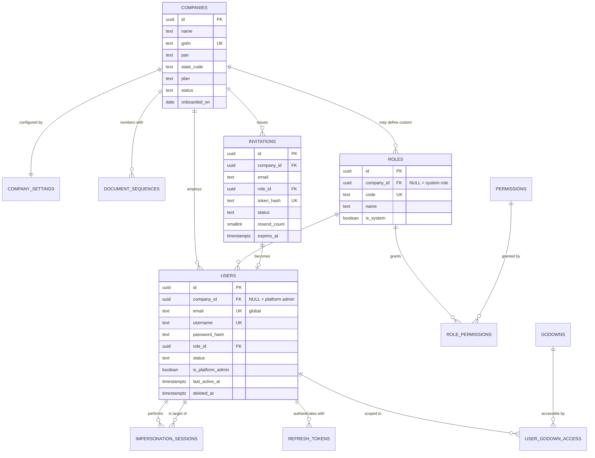
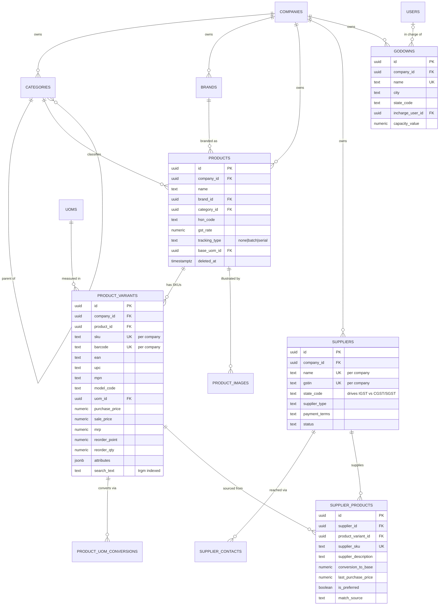
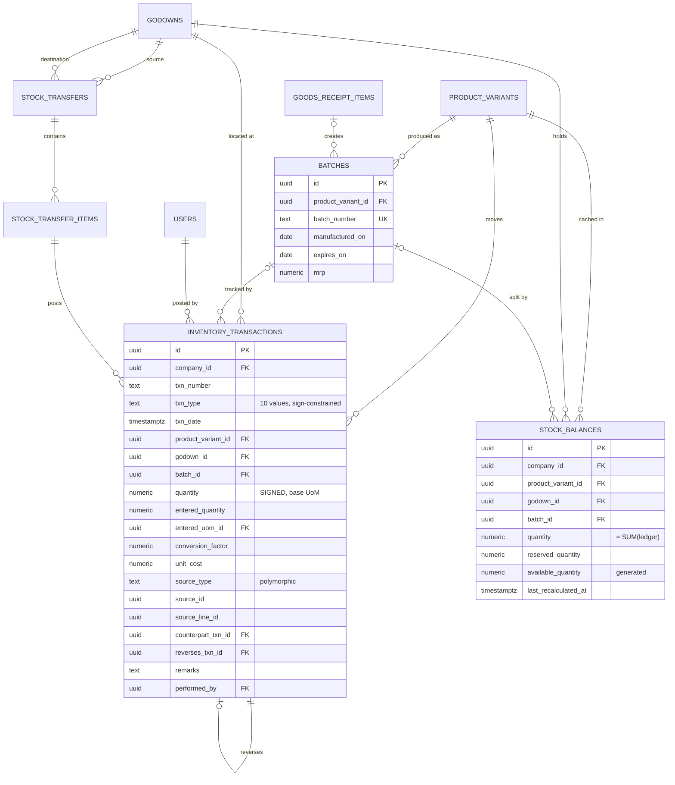
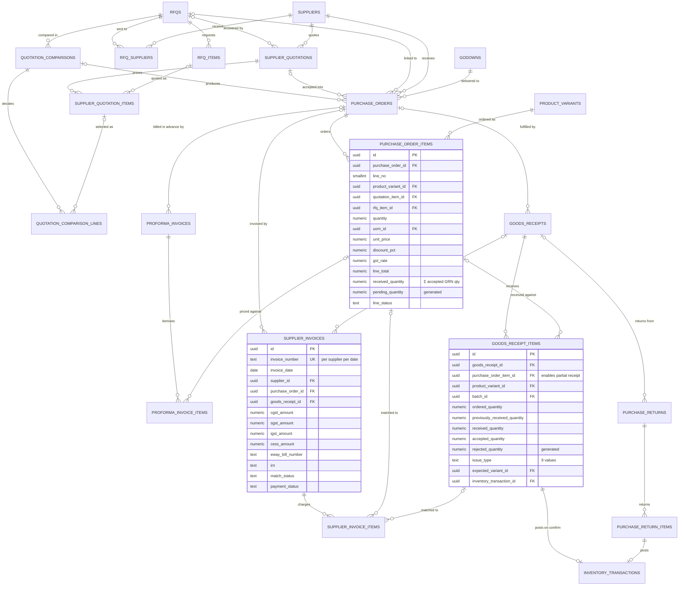
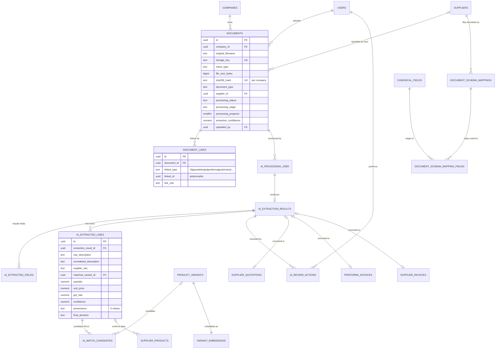
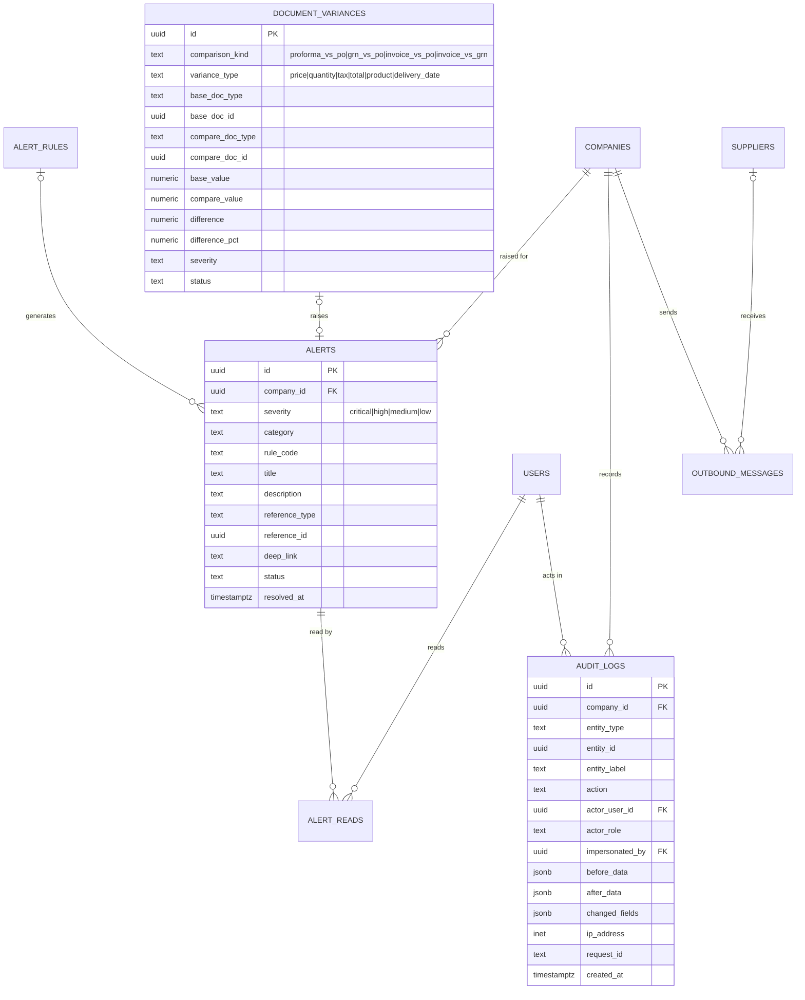
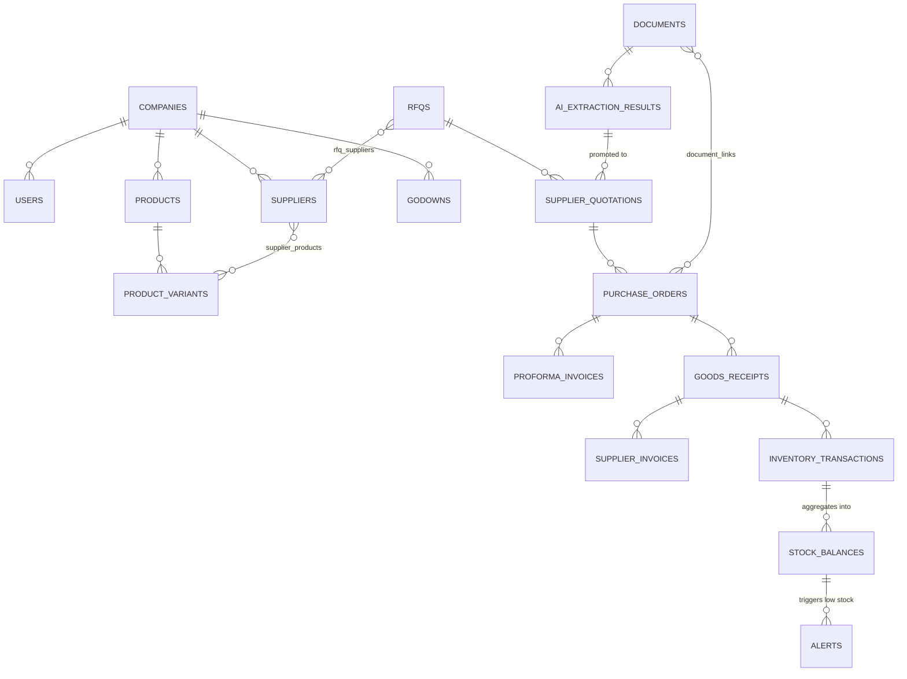

# 03 — DATABASE ERD

Mermaid diagrams for the schema defined in `02_DATABASE_DESIGN.md`. Split by domain because a single 60-entity diagram is unreadable; §7 gives the cross-domain overview.

Legend: `||--o{` one-to-many · `||--||` one-to-one · `}o--o{` many-to-many (always via a join table) · `|o--o{` optional one-to-many.

---

## 1. Tenancy, identity and access



---

## 2. Master data — catalogue, suppliers, godowns



---

## 3. Inventory — the transaction-based core



**Invariant:** `stock_balances.quantity` must always equal `SUM(inventory_transactions.quantity)` for the same key. The cache is written in the same transaction as the ledger row and re-verified nightly.

---

## 4. Procurement chain (RFQ → Invoice)



### Partial-delivery worked example

```
purchase_order_items (qty 100, received_quantity 0,   line_status open)
   ├── goods_receipt_items  GRN-1  received 60, accepted 60 → +60 ledger
   │        → received_quantity 60,  pending 40,  line_status partially_received
   └── goods_receipt_items  GRN-2  received 40, accepted 38, rejected 2 (damaged) → +38 ledger
            → received_quantity 98,  pending 2,   line_status partially_received
            → purchase_returns for the 2 damaged units (if accepted then returned)
            → buyer may short_close the remaining 2
```

---

## 5. Documents and AI



---

## 6. Alerts, variances and audit



---

## 7. Cross-domain overview



---

## 8. Ownership tree

```
COMPANY (tenant)
├── company_settings (1:1)
├── document_sequences
├── users ──── user_godown_access ──── godowns
│     └── invitations, refresh_tokens, impersonation_sessions
├── roles ──── role_permissions ──── permissions
├── categories (self-nesting)
├── brands
├── uoms
├── products
│     └── product_variants  ← the SKU; everything below points here
│           ├── product_uom_conversions
│           ├── variant_embeddings (1:1)
│           ├── batches
│           └── supplier_products ──── suppliers
├── suppliers
│     └── supplier_contacts
├── godowns
│     └── stock_balances ←──────── inventory_transactions (source of truth)
│                                        ▲
├── rfqs                                 │
│     ├── rfq_items                      │
│     └── rfq_suppliers                  │
├── supplier_quotations                  │
│     └── supplier_quotation_items       │
├── quotation_comparisons                │
│     └── quotation_comparison_lines     │
├── purchase_orders                      │
│     └── purchase_order_items           │
├── proforma_invoices                    │
│     └── proforma_invoice_items         │
├── goods_receipts                       │
│     └── goods_receipt_items ───────────┤ posts on confirm
├── purchase_returns                     │
│     └── purchase_return_items ─────────┤ posts on confirm
├── stock_transfers                      │
│     └── stock_transfer_items ──────────┘ posts on dispatch/receipt
├── supplier_invoices
│     └── supplier_invoice_items
├── document_variances
├── documents
│     ├── document_links (→ any business record)
│     └── ai_processing_jobs
│           └── ai_extraction_results
│                 ├── ai_extracted_fields
│                 ├── ai_extracted_lines ──── ai_match_candidates
│                 └── ai_review_actions
├── document_schema_mappings ──── document_schema_mapping_fields ──── canonical_fields
├── alerts ──── alert_reads
├── outbound_messages
└── audit_logs
```

---

## 9. Cardinality reference

| Relationship | Type | Notes |
|---|---|---|
| companies → company_settings | **1:1** | Created with the tenant |
| products → product_variants | 1:N | Minimum one; flat UI products get exactly one |
| product_variants → variant_embeddings | **1:1** | Regenerated when name/attributes change |
| rfqs → rfq_items | 1:N | CASCADE delete while draft |
| rfqs ↔ suppliers | **M:N** | via `rfq_suppliers`, with per-supplier send status |
| rfqs → supplier_quotations | 1:N (optional) | A quotation may exist with no RFQ (rate list) |
| supplier_quotations → items | 1:N | |
| rfq_items → supplier_quotation_items | 1:N (optional) | One requested line, many supplier prices |
| quotation_comparisons → lines | 1:N | One line per RFQ item |
| comparison → purchase_orders | 1:N | **A split decision creates several POs** — the UI already does this with tabs |
| purchase_orders → items | 1:N | |
| purchase_order_items ↔ goods_receipt_items | **M:N in effect** | One PO line receives across many GRNs; modelled as 1:N from the PO line |
| purchase_orders → proforma_invoices | 1:N | Several advance bills against one PO are legal |
| goods_receipt_items → inventory_transactions | **1:1** | One accepted line posts exactly one ledger row (two for a transfer) |
| purchase_order_items → supplier_invoice_items | 1:N | Invoicing may be split |
| suppliers ↔ product_variants | **M:N** | via `supplier_products` — the alias table that makes AI matching converge |
| documents ↔ business records | **M:N** | via `document_links`, polymorphic |
| roles ↔ permissions | **M:N** | |
| users ↔ godowns | **M:N** | via `user_godown_access`; `has_all_godowns` short-circuits |
| alerts ↔ users | **M:N** | via `alert_reads` — read state is per user, not per alert |
| inventory_transactions → inventory_transactions | 1:1 self | `counterpart_txn_id` (transfer pair), `reverses_txn_id` (correction) |
| categories → categories | 1:N self | parent/child = UI category/subcategory |
